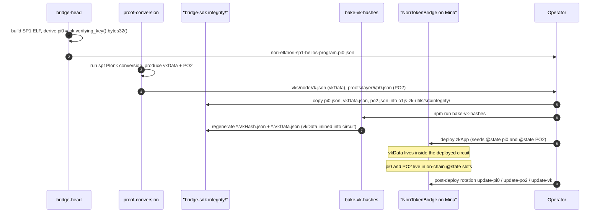

# Architecture

## What it does

Nori-zk carries verifiable Ethereum state to Mina. When a token moves
across the bridge, the destination chain does not trust an off-chain
relayer, a multisig, or an oracle: it verifies a zero-knowledge proof of
Ethereum's own consensus and storage state, produced by running a
Helios light client inside a zkVM. The bridge is a pipeline of proofs,
not a pipeline of attestations.

The three components in this codebase split that pipeline along its
natural seams. **bridge-head** runs Helios inside the SP1 zkVM on the
Ethereum side and emits an SP1 PLONK proof for each Ethereum finality
transition. **proof-conversion** translates that SP1 proof — which Mina
cannot verify directly — into an o1js Pickles proof that Mina's proof
system accepts natively. **bridge-sdk** verifies the converted proof
inside a Mina zkApp, drives the on-chain state, and ships the lock /
unlock contracts on the Ethereum side. The bridged asset on Mina —
nETH — is minted only when an Ethereum deposit has been proven by this
pipeline end-to-end.

Each component has its own repository, its own language, and its own
build system. They are joined by a small set of files whose contents
must match across all three: those files are the trust anchors covered
later on this page.

## The three components

**Bridge head** is a Rust workspace that builds the SP1 zkVM program for
Helios and runs the proving daemon. Its zkVM program reads Ethereum
sync-committee updates and storage proofs and commits a structured
output describing the consensus transition and storage slots it
verified. The output schema lives in
[`nori-primitives::ProofOutputs`](../components/bridge-head/index.md)
and is the contract the rest of the pipeline reads from. The deployed
program's identity is captured by a single field element, **pi0**,
which is also surfaced as a JSON file alongside the compiled ELF. See
the [Bridge Head component page](../components/bridge-head/index.md).

**Proof conversion** is a TypeScript orchestrator paired with a small
Rust pairing-utils crate (shipped both as a native binary and as a WASM
module). It takes an SP1 PLONK proof and re-verifies it inside o1js by
splitting the transcript work into 24 parallel leaf circuits, padding to
the next power of two, and folding the result through a five-layer
binary recursion tree of `layer1` and `node` ZkPrograms. The output is
a single Pickles proof Mina can verify, plus two artefacts the
destination chain must pin in advance: **vkData** (the recursion `node`
program's verification key) and **PO2** (the recursion-tree root
digest). See the [Proof Conversion component page](../components/proof-conversion/index.md).

**Bridge SDK** is a TypeScript monorepo containing the o1js zkApp on
Mina, the Solidity lock / unlock contracts on Ethereum, the integration
worker, and the integrity files that pin pi0, vkData and PO2 into the
build. Its `NoriTokenBridge` zkApp method `update()` verifies a
converted Plonk proof against those anchors and advances the on-chain
state; the matching Ethereum-side contract locks and unlocks the
underlying asset. See the [Bridge SDK component page](../components/bridge-sdk/index.md).

## Container diagram

```mermaid
flowchart LR
    ETH[Ethereum<br/>L1 consensus + storage] -->|sync updates,<br/>storage proofs| BH
    BH[bridge-head<br/>Helios inside SP1 zkVM] -->|SP1 PLONK proof<br/>+ pi0 fingerprint| PC
    PC[proof-conversion<br/>SP1 → o1js Pickles] -->|Pickles proof<br/>+ vkData + PO2| SDK
    SDK[bridge-sdk<br/>zkApp + contracts] -->|update tx,<br/>mint / burn| MINA[Mina<br/>NoriTokenBridge zkApp]

    classDef chain fill:#e1f5ff,stroke:#0c5460,color:#000
    classDef component fill:#fff3cd,stroke:#856404,color:#000
    class ETH,MINA chain
    class BH,PC,SDK component
```

Each arrow is the only contract between two stages. bridge-head and
proof-conversion never talk to Mina directly; bridge-sdk never sees the
SP1 proof. Trust anchor values flow alongside this data path at build
and deploy time, and are baked into bridge-sdk's circuit constants and
on-chain state before any user transaction runs.

## End-to-end data flow

A new Ethereum finality arrives. bridge-head's `nbhead` daemon —
running its main event loop in
[`nori/src/bridge_head/api.rs`](../components/bridge-head/index.md) —
fetches the sync-committee update and the storage proofs for the
configured bridge contract, packages them into the SP1 zkVM's input
encoding, and invokes the prover. The zkVM program runs Helios's
consensus transition end-to-end, walks the Merkle-Patricia storage
proofs, and commits the structured `ProofOutputs` to its public output.

The resulting SP1 PLONK proof is handed to proof-conversion. Its
`sp1Plonk` plan splits the PLONK verifier transcript into 24
leaf-level o1js circuits, runs them in parallel processes (gated by
`MAX_PROCESSES`, default 1, ceiling ~32), and pads to 32 leaves with a
construction that lets the layer-1 circuit safely verify the dummies
without permitting a malicious prover to substitute them. The 32
leaf-proofs are folded through five compression layers — `layer1` at
the bottom, `node` at layers 2-5 — and the root produces a single
Pickles proof. Its public output carries two values the destination
chain will check: `rightOut`, the chained transcript output, and
`subtreeVkDigest`, a Poseidon chain committing transitively to every
verification key used inside the tree. See the
[Proof Conversion component page](../components/proof-conversion/index.md)
for the recursion shape and the b1114 identity-constraint fix.

bridge-sdk receives the converted proof. The Mina zkApp method
`NoriTokenBridge.update(input, proof, oldestAction)` (line 348 in
[`contracts/mina/src/NoriTokenBridge.ts`](../components/bridge-sdk/index.md))
calls the private `ethVerify(input, proof)`, which executes three
assertions in sequence — A1 / A2 / A3, described below. Only if all
three pass does the method advance the on-chain state, append the
storage-root reference, and unlock the corresponding deposit attestor
output.

On the Ethereum side, the same release of bridge-sdk ships the
counterpart Solidity contract, `NoriTokenBridge.sol`, which holds the
locked asset and is released by a withdrawal proof. The Ethereum and
Mina sides do not communicate with each other directly: both treat
the proof pipeline as the source of truth and the on-chain state as
the join point.

Throughout this flow the data path is asymmetric — proofs go
Ethereum → Mina, asset custody goes both ways — but the trust path is
symmetric: every step is a zero-knowledge proof of the previous step,
all the way down to the SP1 program's identity.

## Sequence diagram — deploy-time trust anchors

The three trust anchors — pi0, vkData, PO2 — must be agreed across all
three components before the bridge can verify anything. They are
generated by bridge-head and proof-conversion, baked into bridge-sdk's
build, and seeded into Mina's on-chain state at deploy. The diagram
below shows the handoffs.

pi0 fingerprints the SP1 ELF: the same value falls out of any host
that builds the program in the canonical Docker container, which is
how bridge-head and bridge-sdk agree on it without sharing build
state. vkData and PO2 are circuit-level identities of the recursion
tree, generated once per proof-conversion build and pinned in
bridge-sdk's integrity directory. After a deploy, pi0 and PO2 can be
rotated by admin transaction without redeploying the zkApp; rotating
vkData requires re-baking the circuit and submitting a verification-key
update.

*Runtime mint / burn flow: forthcoming.*

## Trust anchors

The three anchors carry three different load-bearing identities. pi0
binds the deployed bridge to a specific SP1 program: any proof produced
by a different ELF will have a different pi0, and the on-chain check
will fail. vkData binds it to a specific proof-conversion build: change
the recursion `node` ZkProgram and the converted proof verifies against
a different VK, breaking the inlined circuit constant. PO2 binds it to
the entire VK chain of the recursion tree: any leaf or layer-1 VK
change moves PO2, because PO2 is a Poseidon chain transitively
committing to every VK used inside the tree.

`NoriTokenBridge.ethVerify(input, proof)` enforces all three together,
on every `update()` call:

- **A1** — `proof.verify(vk)` with `vk` constructed from the inlined
  `proofConversionSP1ToPlonkVkData` constant. The converted proof
  must verify against the proof-conversion VK baked into this build.
- **A2** — `proof.publicOutput.subtreeVkDigest.assertEquals(ethNodeVk)`
  where `ethNodeVk = this.proofConversionPO2.getAndRequireEquals()`.
  The recursion-tree root digest carried inside the proof must match
  the on-chain PO2.
- **A3** — `piDigest.assertEquals(proof.publicOutput.rightOut)` where
  `piDigest = Poseidon([pi0, parsePlonkPublicInputsProvable(EthInput)])`
  and `pi0 = this.noriHeliosProgramPi0.getAndRequireEquals()`. The
  SP1 program identity and the caller-supplied Ethereum input bytes
  must together hash to the value the converted proof commits to as
  its right output.

If any of the three assertions fails the method reverts and the
state does not advance. The detail walkthrough — exact line ranges,
rotation procedures, and which operator transaction touches each
anchor — lives in **[Trust anchors](../audit/index.md)**.
<!-- agent-managed: trust-anchors link target will move to architecture/trust-anchors.md when REP-2.2 lands -->

## See also

- [Bridge Head](../components/bridge-head/index.md) — the SP1 zkVM
  proof producer on the Ethereum side.
- [Proof Conversion](../components/proof-conversion/index.md) — the
  SP1-to-o1js recursion tree.
- [Bridge SDK](../components/bridge-sdk/index.md) — the Mina zkApp,
  the Ethereum contracts, and the integrity layer.
- [Trust anchors](../audit/index.md) — full pi0 / vkData / PO2
  walkthrough and the A1 / A2 / A3 assertion code.
- [Concepts](../concepts/index.md) — Ethereum light clients, SP1,
  Mina, and Pickles in plain language.
- [Operations](../operations/index.md) — build, deploy, and rotation
  runbooks.
- [Audit](../audit/index.md) — scope, status, and findings index.
- [Roadmap](../roadmap.md) — what is shipped, what is next.
