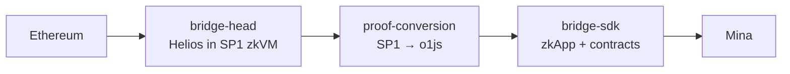

# Architecture

Nori-zk carries verifiable Ethereum state to Mina through three components.
**bridge-head** runs a Helios light client inside the SP1 zkVM to produce
Ethereum consensus proofs. **proof-conversion** translates those SP1 proofs
into a form that Mina's proof system can verify. **bridge-sdk** verifies the
converted proofs on Mina and drives the on-chain bridge state.

## Data flow

## What lives where

- **Consensus proving** — bridge-head (Rust, SP1 zkVM).
- **Proof translation** — proof-conversion (TypeScript orchestration with a
  Rust pairing-utils crate, shipped natively and as a WASM module).
- **Mina-side verification and state** — bridge-sdk (TypeScript; Solidity for
  the Ethereum-side contracts, o1js for the Mina zkApp).
