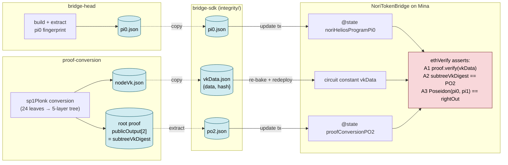

# Trust anchors

Nori-zk pins the chain of trust between Ethereum and Mina to three values:
**pi0**, **vkData**, and **PO2**. They originate in different components,
travel through the SDK as small JSON files, and end up either as on-chain
state or as a circuit constant inside the Mina zkApp. Every accepted
`update` transaction must prove all three are correct for the proof being
submitted; if any one is wrong, the transaction reverts.

This page walks through where each anchor comes from, how it reaches the
chain, and the three assertions inside
`NoriTokenBridge.ethVerify` that bind them together.

## The three anchors

- **pi0** — the identity of the SP1 program (the Helios light-client
  zkVM image). A 78-digit field element. It binds every proof to the
  exact ELF that produced it.
- **vkData** — the o1js verification key for the recursion `node`
  ZkProgram in proof-conversion. A `{ data, hash }` pair that lets the
  Mina contract verify the converted Plonk proof.
- **PO2** — the recursion tree root digest. A single Poseidon-chained
  field that transitively commits to all leaf VKs and the two aggregator
  VKs used during proof conversion.

Together, they answer three different questions: *was the right program
run?* (pi0), *was the right converter used to wrap its proof?* (vkData),
*and was the recursion tree underneath that conversion the canonical
one?* (PO2).

## Origin

### pi0 — bridge-head

`pi0` is derived deterministically from the compiled SP1 ELF for the
Nori Helios program. The build harness produces the ELF in Docker; a
second binary re-reads the ELF, computes the SP1 verifying-key
`bytes32()` fingerprint, converts the hex string to a decimal field
element, and writes the result as a JSON-quoted string.

Because the value is a function of the ELF only — not of any particular
proof — the same `pi0` results whether the ELF was run under a real
prover or under the mock prover for testing. That is what makes it a
program identifier rather than a proof identifier.

Detail and exact build commands: see
[Bridge Head — zk artifact lifecycle](../components/bridge-head/index.md#zk-artifact-lifecycle).

### vkData — proof-conversion

`vkData` is the o1js Pickles verification key for the recursion `node`
ZkProgram in proof-conversion. The `node` program is used at every
compression layer above layer-1, so a single VK covers layers 2 through
5 of the recursion tree. The conversion run materialises the VK at
`vks/nodeVk.json` in its working directory and emits it as the
`vkData` field of the conversion output.

Detail and the conversion output shape: see
[Proof Conversion — Output shape](../components/proof-conversion/index.md#output-shape).

### PO2 — proof-conversion

`PO2` is the `subtreeVkDigest` field at the root of the recursion tree —
`publicOutput[2]` of the root proof at `proofs/layer5/p0.json`. By
construction the `node` ZkProgram computes its `subtreeVkDigest` as
`Poseidon(vkLeft.hash, vkRight.hash, leftDigest, rightDigest, layer)`,
so the digest at the tree root transitively commits to every VK used
in the tree: the 24 leaf VKs (`vk0..vk23`), the `layer1` aggregator VK,
and the `node` VK itself. Any drift in any of these VKs changes the
PO2.

PO2 is bound to vkData by construction: a proof that verifies under a
given `node` VK necessarily has its `subtreeVkDigest` rooted in the
matching VK chain. The Mina contract checks both anchors anyway as
defence in depth.

Detail and the recursion tree shape: see
[Proof Conversion — The PLONK conversion path](../components/proof-conversion/index.md#the-plonk-conversion-path).

## The flow



## Landing in the SDK

The bridge-sdk holds the three anchor values in
`o1js-zk-utils/src/integrity/`:

- `nori-sp1-helios-program.pi0.json` — a copy of the bridge-head
  pi0 output.
- `ProofConversion.sp1ToPlonk.vkData.json` — `{ data, hash }` copied
  from the conversion output's `vkData` field.
- `ProofConversion.sp1ToPlonk.po2.json` — `publicOutput[2]` extracted
  from the conversion output's root proof.

Each JSON file has a thin generated `.ts` companion that re-exports the
JSON as a typed module. The three exported symbols —
`bridgeHeadNoriSP1HeliosProgramPi0`, `proofConversionSP1ToPlonkVkData`,
`proofConversionSP1ToPlonkPO2` — are the SDK's public entry points for
the anchors.

After any of the three JSON files is updated, `npm run bake-vk-hashes`
at the SDK workspace root must be re-run. Baking recompiles the Mina
zkApp circuits (the `EthVerifier` program in `o1js-zk-utils` and the
contracts under `contracts/mina`) and writes the resulting
verification-key hashes and data into the matching `*.VkHash.json` /
`*.VkData.json` files. Recompilation is necessary because `vkData` and
`pi0` are inlined into the circuit as constants — changing them
without re-baking would leave the deployed circuit out of sync with
the JSON.

Detail on the integrity directory layout and which symbols are imported
where: see
[Bridge SDK — Trust anchors](../components/bridge-sdk/index.md#trust-anchors).

## On-chain enforcement

When `NoriTokenBridge.update(input, proof, oldestAction)` is called on
Mina, it runs the private helper `ethVerify(input, proof)`, which
enforces the three trust anchors via three assertions.

**A1 — `proof.verify(vk)`.** The verification key is built inline from
the circuit-baked `proofConversionSP1ToPlonkVkData`:

```ts
const vk = VerificationKey.fromValue({
    data: proofConversionSP1ToPlonkVkData.data,
    hash: Field(proofConversionSP1ToPlonkVkData.hash),
})
proof.verify(vk);
```

This proves the converted Plonk proof was produced by the expected
proof-conversion `node` ZkProgram. *If this fails, `update` reverts.*

**A2 — `proof.publicOutput.subtreeVkDigest.assertEquals(ethNodeVk)`.**
`ethNodeVk` is read from on-chain state via
`this.proofConversionPO2.getAndRequireEquals()`. This proves the
recursion tree underneath the converted proof committed to the
expected VK chain — the same chain encoded by the deployed `vkData`.
*If this fails, `update` reverts.*

**A3 — `piDigest.assertEquals(proof.publicOutput.rightOut)`,** where
`piDigest = Poseidon([pi0, pi1])`. `pi0` is read from on-chain state
(`this.noriHeliosProgramPi0.getAndRequireEquals()`); `pi1` is the
provable hash of the serialised `EthInput` bytes the caller supplied.
This proves the proof was produced by *our* SP1 Helios program for
*these specific* `EthInput` values — not by a different program, and
not for some other inputs.
*If this fails, `update` reverts.*

The three assertions are independent: an attacker substituting any one
anchor while keeping the others would fail at least one check.

## Rotation

Each anchor has its own rotation path. The differences matter because
they govern how often each can be safely rotated and how much
operational machinery is involved.

- **pi0 — `updateNoriHeliosProgramPi0` transaction.** The SDK copies a
  new `pi0.json` from bridge-head's output, and an admin tx writes the
  new value into the on-chain state slot. No VK change, no redeploy.
  Expected to change **frequently** as the Helios light client
  evolves.

- **PO2 — `updateProofConversionPO2` transaction.** The SDK updates
  `po2.json`, and an admin tx writes the new value into the on-chain
  state slot. No VK change, no redeploy. Expected to change **rarely** —
  for instance when SP1 undergoes a major version upgrade (e.g.
  v5 → v6) that affects the cryptography of proof conversion.

- **vkData — re-bake + `updateVerificationKey` transaction.** The SDK
  updates `vkData.json`, then `npm run bake-vk-hashes` is run to
  recompile the zkApp circuits with the new constant inlined, and an
  admin tx rotates the deployed verification key. Expected to change
  **very rarely**, because a vkData rotation is effectively a new
  contract deployment of the proof-conversion verification path.

A combined script, `npm run update:integrity-params`, batches the pi0
and PO2 transactions for releases that change both. vkData always
rotates on its own because of the bake-and-redeploy requirement.

## Operational summary

| Anchor   | Origin                                                | SDK file                                              | On-chain slot                            | Rotation                                              |
|----------|-------------------------------------------------------|-------------------------------------------------------|------------------------------------------|-------------------------------------------------------|
| `pi0`    | bridge-head ELF fingerprint                           | `integrity/nori-sp1-helios-program.pi0.json`          | `@state noriHeliosProgramPi0`            | `updateNoriHeliosProgramPi0` tx                       |
| `vkData` | proof-conversion `node` ZkProgram VK                  | `integrity/ProofConversion.sp1ToPlonk.vkData.json`    | inlined as circuit constant              | re-bake + `updateVerificationKey` tx                  |
| `PO2`    | proof-conversion root proof `publicOutput[2]`         | `integrity/ProofConversion.sp1ToPlonk.po2.json`       | `@state proofConversionPO2`              | `updateProofConversionPO2` tx                         |
