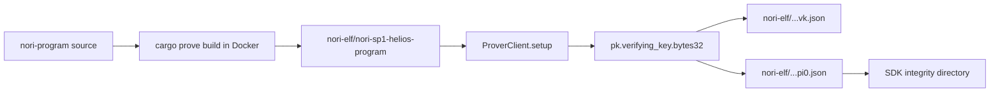

# Bridge Head

## Role

The **bridge-head** is the Ethereum-side proof producer for the Nori
bridge. It runs a Helios light client inside the SP1 zkVM, advances a
`LightClientStore` across finality transitions, and on each transition
emits a zero-knowledge proof that commits to (a) the new consensus
state and (b) Merkle-Patricia storage proofs over the source token
bridge contract. Downstream Mina components consume these proofs to
mirror Ethereum state without trusting an external oracle.

## Source

- Repository: <https://github.com/Nori-zk/nori-bridge-head>
- Language: Rust (`edition = "2021"`), targeting the SP1 zkVM
- License: MIT
- Origin: forked from
  [`succinctlabs/sp1-helios`](https://github.com/succinctlabs/sp1-helios);
  upstream authors `xavierdmello`, `ratankaliani`

## Architecture

`nori-bridge-head` is a Cargo workspace. Members declared in
[`Cargo.toml`](https://github.com/Nori-zk/nori-bridge-head/blob/develop/Cargo.toml):

| Crate | Role |
|---|---|
| `nori` | Main crate. Hosts the `nbhead` daemon, the SP1 prover client, the gRPC surface, and the consensus / execution RPC adapters. |
| `nori/src/contract_bindings` | Generated bindings to the `NoriTokenBridge` Solidity contract. |
| `nori-hash` | Hashing helpers — Poseidon adapters over `mina-poseidon`, sha256 over the SP1-patched `sha2`, and a fixed-depth Merkle tree used by storage-proof attestation. |
| `nori-program` | The SP1 zkVM **program** — consensus update verification (Helios) plus MPT storage-proof verification. This is the code that gets compiled to a RISC-V ELF and proven. |
| `nori-build-zk` | Build harness that drives `cargo prove build`, writes the ELF, and derives the verifying-key fingerprint. |

Two more directories are present but not workspace members:
`nori-primitives/` (path-dep crate defining `ProofOutputs` /
`ConsensusProofOutputs`) and `nori-elf/` (the committed build
artifacts).

## Public API

Two binaries are declared in
[`nori/Cargo.toml`](https://github.com/Nori-zk/nori-bridge-head/blob/develop/nori/Cargo.toml):

- **`nbhead`** — the bridge head daemon. Boots a `BridgeHead` event
  loop that reacts to Ethereum finality changes, schedules SP1 proving
  jobs, and emits `ProofMessage` payloads to whichever observer is
  attached. Entrypoint: `nori/bin/nori_bridge_head.rs`. Canonical
  invocation: `cargo run -p nori --bin nbhead`.
- **`extract_zeroth_public_input`** — one-shot helper. Loads the
  built ELF, computes its SP1 verifying-key fingerprint
  (`pk.verifying_key().bytes32()`), and writes the decimal form to
  `nori-elf/nori-sp1-helios-program.pi0.json`. This file is the SP1
  program identity that the downstream SDK pins as the proof-system's
  first public input. Entrypoint:
  `nori/bin/extract_zeroth_public_input.rs`.

The proof's public output is laid out by two structs in
`nori-primitives/src/types.rs`:

- `ProofOutputs` (228 bytes) — full bridge proof. Commits to slot
  transitions, store-hash chaining, execution state root, contract
  storage-slots root, next sync-committee hash, contract address, and
  the chain's genesis root.
- `ConsensusProofOutputs` (176 bytes) — consensus-only variant
  without the storage-slot commitment.

Field-by-field byte layouts are tracked in the API reference.

## Build & test

System dependencies (Ubuntu / Debian):

```bash
sudo apt install -y protobuf-compiler build-essential pkg-config libssl-dev
```

`protobuf-compiler` is required because the SP1 SDK depends on `prost`.

Standard build and test:

```bash
cargo build --release
cargo test -- --nocapture
```

To rebuild the zk artifacts (ELF + verifying key + program identity),
use the canonical script — it cleans `target/`, runs `cargo prove
build` in Docker via `nori-build-zk`, then derives the pi0 fingerprint:

```bash
./nori/rebuild-zk.sh
# add --no-sudo if your target/ is already user-writable
```

Run the daemon (requires a populated `.env`):

```bash
cargo run -p nori --bin nbhead
```

See the repo's
[`.env.example`](https://github.com/Nori-zk/nori-bridge-head/blob/develop/.env.example)
for the full required + optional environment surface (RPC endpoints,
SP1 prover mode, prover-network knobs).

## zk artifact lifecycle

The proving key is deterministic given the program ELF: the same
source compiles to the same ELF, which produces the same verifying
key, whose hash is the pi0 fingerprint pinned on Mina.



All three artifacts under `nori-elf/` (the ELF, `.vk.json`, `.pi0.json`)
are committed to the repo and rotated together by `rebuild-zk.sh`.

## State machine sketch

At runtime, `nbhead` is a single event loop in
[`nori/src/bridge_head/api.rs`](https://github.com/Nori-zk/nori-bridge-head/blob/develop/nori/src/bridge_head/api.rs)
that multiplexes finality polling, external commands, and prover-job
completions:

```mermaid
stateDiagram-v2
    [*] --> Booting
    Booting --> Idle: warm or cold start resolved
    Idle --> Proving: finality change detected
    Proving --> Idle: job succeeded; observer notified
    Proving --> Idle: job failed; transition aborted
    Idle --> [*]: ctrl-c
```



Cold start reads `(slot, store_hash)` from a consensus RPC; warm
start loads them from a local checkpoint file.

## Operations

- **`SP1_PROVER` modes** are `mock`, `cpu`, `cuda`, and `network`,
  validated in
  [`nori/src/sp1_prover_config.rs`](https://github.com/Nori-zk/nori-bridge-head/blob/develop/nori/src/sp1_prover_config.rs).
  `mock` produces shape-valid but cryptographically meaningless
  proofs — useful for local development only. `cpu` is real but slow
  enough that it cannot keep pace with Ethereum finality cadence on
  mainnet. Production deployments use `cuda` (local GPU) or
  `network` (Succinct Prover Network).
- **Workspace vs. also-present split.** `nori-primitives/` and
  `nori-elf/` are referenced via path dependencies and live alongside
  the workspace, not inside it. They still compile and ship with the
  rest of the repo.
- **`nbhead` invocation form.** The README's `cargo run --bin nbhead`
  works because the binary name is unique, but the defensive form is
  `cargo run -p nori --bin nbhead` — it survives future workspace
  additions that might collide on bin names.
- **Required environment surface.** The daemon refuses to start
  without `SP1_PROVER` and `SP1_PROOF_TYPE`. The consensus and
  execution HTTP RPC env vars accept comma-delimited fallback lists.

## See also

- [Architecture overview](../../architecture/index.md)
- Trust anchors *(sub-page in development)*
- [Bridge SDK](../bridge-sdk/index.md)
- [Proof Conversion](../proof-conversion/index.md)
- [Components overview](../index.md)
