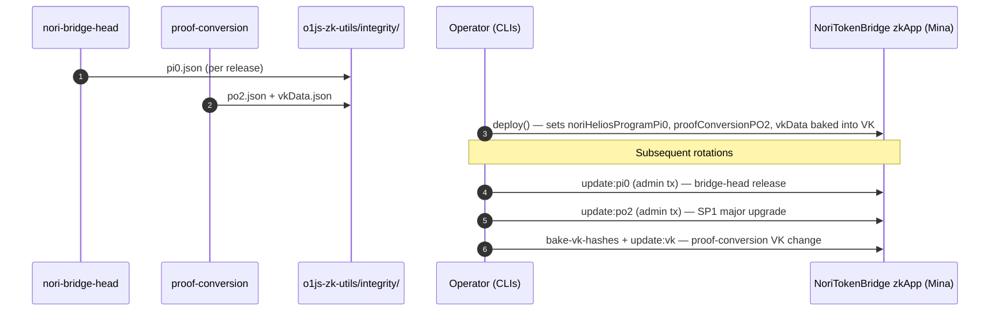

# Bridge SDK

## Role

The **bridge-sdk** is the Mina-side counterpart to bridge-head, the
Ethereum-side bridge contracts, and the TypeScript integration layer that
ties them together. Bridge-head produces an SP1 consensus-MPT transition
proof from an Ethereum block; proof-conversion turns that into an o1js-
verifiable Plonk proof; bridge-sdk is what verifies that proof on Mina,
mints/burns the bridged token, locks/unlocks on Ethereum, and provides the
worker, attestation, and integrity-anchor machinery a client needs to drive
the end-to-end flow. Every on-chain action on either side of the bridge
ultimately runs through code in this repo.

## Source

- **Repository:** <https://github.com/Nori-zk/nori-bridge-sdk> (branch:
  `develop`)
- **Languages:** TypeScript (workspaces, o1js programs, tasks) and
  Solidity ^0.8.28 (Ethereum contracts)
- **License:** Apache-2.0 at repo root (the `contracts/ethereum`
  workspace declares MIT in its `package.json`; the Solidity files
  themselves carry per-file SPDX headers — reconciliation is tracked as
  a pre-mainnet open item)
- **npm scope:** `@nori-zk/`. Four workspaces publish publicly to
  `registry.npmjs.org`: `@nori-zk/workers`,
  `@nori-zk/o1js-zk-utils`, `@nori-zk/ethereum-token-bridge`, and
  `@nori-zk/mina-token-bridge`. Two workspaces are marked
  `"private": "true"` and are not published — `@nori-zk/cache-server`
  and `nori-client-minimal` — though their **source remains public in
  this repo**.

## Architecture

| Workspace             | npm name                          | Language(s)         | Role                                                                       |
| --------------------- | --------------------------------- | ------------------- | -------------------------------------------------------------------------- |
| `workers`             | `@nori-zk/workers`                | TypeScript          | Node/browser worker abstraction for off-main-thread proof compilation and execution. |
| `o1js-zk-utils`       | `@nori-zk/o1js-zk-utils`          | TypeScript / o1js   | Deposit attestation, merkle attestor, byte/Field helpers, integrity anchors. |
| `contracts/ethereum`  | `@nori-zk/ethereum-token-bridge`  | Solidity, TypeScript | `NoriTokenBridge.sol` (lock/unlock + fee accounting), Hardhat tasks, OZ TimelockController integration. |
| `contracts/mina`      | `@nori-zk/mina-token-bridge`      | TypeScript / o1js   | `NoriTokenBridge` zkApp, storage zkApp, proof submitter, operator CLIs.    |
| `cache-server`        | `@nori-zk/cache-server`           | TypeScript          | uWebSockets.js static server that delivers pre-compiled o1js VK / circuit cache layouts to clients. Not published to npm. |
| `minimal-client`      | `nori-client-minimal`             | TypeScript          | Puppeteer-driven browser end-to-end harness that exercises the full ETH→Mina flow. Not published to npm. |

All four o1js-consuming workspaces pin the same peer:
`o1js@3.0.0-mesa.698ca`.

## Public API

**`@nori-zk/workers`** exports the worker plumbing:
`createWorker`, `createProxy`, `WorkerParentBase`, `WorkerChildBase`, and
the parent/child interfaces. Subpath exports expose node and browser
entry points (`./node/parent`, `./node/child`, `./browser/parent`,
`./browser/child`). The pattern is "build a proxy class on the parent
side that mirrors the worker class on the child side and forwards calls
across a JSON message channel"; this is what `contracts/mina` uses to
run `tokenBridgeWorker` (off-main-thread Mina prover) and
`tokenBridgeTester` (test harness worker).

**`@nori-zk/o1js-zk-utils`** is the o1js helper library. The
re-exports of interest to an integrator (see `o1js-zk-utils/src/index.ts`)
are the merkle attestor helpers (`buildMerkleTree`,
`computeMerkleRootFromPath`, `foldMerkleLeft`,
`getMerklePathFromLeaves`, `merkleLeafAttestorGenerator`), the deposit
attestor (`ContractDepositAttestor`, `ContractDepositAttestorInput`,
`ContractDepositAttestorProof`, `buildContractDepositLeaves`,
`getContractDepositWitness`), the `EthInput` struct + byte/Field
utilities, the three integrity-anchor re-exports
(`bridgeHeadNoriSP1HeliosProgramPi0`,
`proofConversionSP1ToPlonkPO2`, `proofConversionSP1ToPlonkVkData`),
and an `EthVerifier` ZkProgram (`o1js-zk-utils/src/ethVerifier.ts`)
kept as a **legacy reference**. The live, deployed verification path is
the inline `ethVerify` method on the Mina-side zkApp.

**`@nori-zk/mina-token-bridge`** exports the `NoriTokenBridge`
zkApp class (`contracts/mina/src/NoriTokenBridge.ts`). The deployed
contract exposes one verification entry point — `@method update(input,
proof, oldestAction)` at `NoriTokenBridge.ts:348` — plus three admin
rotation entry points at `NoriTokenBridge.ts:643-655`:
`updateVerificationKey`, `updateNoriHeliosProgramPi0`, and
`updateProofConversionPO2` (with `updateStoreHash` immediately
following).

**`@nori-zk/ethereum-token-bridge`** exposes the Solidity
`NoriTokenBridge` contract plus a set of Hardhat tasks for lock,
fee management, and operator rotation (`test:lock`, `get-fee-info`,
`set-fee-rate`, `set-fee-recipient`, `withdraw-fees`,
`set-bridge-operator`).

## Build & test

Test files follow the pattern documented in
`README.TEST-CONVENTIONS.md`:

```
<fileName>.<number>?.<unit|integration|e2e>.spec.ts
```

`*.unit.spec.ts` are deterministic and offline,
`*.integration.spec.ts` exercise multiple components or ZK programs
together (and may require `lightnet`), and `*.e2e.spec.ts` drive full
ETH→Mina workflows (`*.devnet.e2e.spec.ts`,
`*.lightnet.e2e.spec.ts`). Each test file runs in its own Node process
via a bash `for`-loop in the workspace's `test:unit` / `test:integration` /
`test:e2e` scripts, which contains o1js memory growth across files.

The canonical CI entry point is **`npm run test-ci`** (not
`npm run test`): each workspace's `test-ci` script selects a deliberately
bounded subset designed for the CI runtime budget. Use `npm run test`
locally when you want the full suite for a workspace.

A cross-language Merkle root reproducibility harness lives at
`o1js-zk-utils/test/cross-reference-roots.sh`
(see `o1js-zk-utils/test/CROSS-REFERENCE-ROOTS.md`) and validates
Rust ↔ TS non-provable ↔ TS provable Merkle root agreement.

## Trust anchors

For the cross-component story of how `pi0`, `vkData`, and `PO2` flow
between bridge-head, proof-conversion, and the Mina-side zkApp, see
**[Trust anchors](../../architecture/trust-anchors.md)**. This section
documents the **SDK-specific** mechanics: where the integrity files live,
which Mina-side state slots consume them, and which operator commands
rotate them.

The Mina-side bridge does **not** bake its trust-anchor values into the
circuit verification key. Instead, three values are kept as updatable
on-chain state, with the SDK shipping the canonical values as JSON files
that operators can rotate as upstream programs evolve. The three integrity
files all live under `o1js-zk-utils/src/integrity/`:

| File (under `o1js-zk-utils/src/integrity/`)        | Anchors                                       | Mina-side consumer                                   |
| -------------------------------------------------- | --------------------------------------------- | ---------------------------------------------------- |
| `nori-sp1-helios-program.pi0.json`                 | SP1 program identifier (Nori SP1-Helios ELF)  | `@state(FrC) noriHeliosProgramPi0`                   |
| `ProofConversion.sp1ToPlonk.po2.json`              | proof-conversion public output digest         | `@state(Field) proofConversionPO2`                   |
| `ProofConversion.sp1ToPlonk.vkData.json`           | proof-conversion verification key data + hash | inlined `VerificationKey` consumed by `ethVerify()`  |

`pi0` and `po2` are first-class `@state` slots set at deploy and rotated
via dedicated admin methods (`updateNoriHeliosProgramPi0`,
`updateProofConversionPO2`). The proof-conversion `vkData` is a circuit
constant — it is read at proof-build time from the integrity JSON and
becomes part of the deployed VK; rotating it requires a re-bake plus an
`updateVerificationKey` transaction.



## Operations

The operator-facing scripts live in
`contracts/mina/src/bin/` and are exposed as npm scripts on the
`@nori-zk/mina-token-bridge` workspace. The full set:

```bash
# Deploy / pre-deploy
npm run derive-token-id   --workspace=@nori-zk/mina-token-bridge
npm run deploy            --workspace=@nori-zk/mina-token-bridge
npm run deploy-with-keys  --workspace=@nori-zk/mina-token-bridge   # testing only

# Integrity rotation
npm run update:pi0              --workspace=@nori-zk/mina-token-bridge
npm run update:po2              --workspace=@nori-zk/mina-token-bridge
npm run update:integrity-params --workspace=@nori-zk/mina-token-bridge
npm run update:store-hash       --workspace=@nori-zk/mina-token-bridge
npm run update:vk               --workspace=@nori-zk/mina-token-bridge
npm run update:vk-non-provable  --workspace=@nori-zk/mina-token-bridge

# VK artefact maintenance
npm run bake-vk-hashes    --workspaces --if-present
npm run migrate-vk-to-tag --workspace=@nori-zk/mina-token-bridge

# Cache / ops
npm run build:cache-layouts --workspace=@nori-zk/mina-token-bridge
npm run poll-deposits-root  --workspace=@nori-zk/mina-token-bridge
npm run prove-and-submit    --workspace=@nori-zk/mina-token-bridge
npm run load-runner         --workspace=@nori-zk/mina-token-bridge
```

The end-to-end production sequence — FROST 3/4 threshold keys,
pre-deploy `npm run pre-deploy`/`derive-token-id`, deploy, then
`bake-vk-hashes` followed by initial integrity-params posting — is
documented in `contracts/DEPLOYMENT.md`.

The Ethereum-side deploy is driven from the `contracts/ethereum`
workspace with `npm run pre-deploy` (fetches the genesis validators
root into `.env.nori-eth-pre-deploy`), `npm run deploy`, and
`npm run deploy-timelock` for the governance `TimelockController`.

### Quirks

- **o1js peer-dep churn.** `o1js` is pinned at a tagged pre-release
  (`3.0.0-mesa.698ca`); a diagnostic at the repo root,
  `determine-o1js-breaking-changes.js`, helps surface breakage when
  the peer-dep moves.
- **Cache layouts dance.** `contracts/mina` produces the VK cache via
  `npm run build:cache-layouts`; `@nori-zk/cache-server` then serves
  the resulting layout directory over HTTP (uWebSockets.js) for browser
  clients that need pre-compiled circuit data. The `cache-server`
  workspace exposes a convenience `npm run build:cache` that chains
  into the `contracts/mina` build.
- **minimal-client visibility.** The repo as a whole is public on
  GitHub, but `minimal-client/package.json` has `"private": "true"` so
  the package is **not published to npm**. Treat it as
  "source-public, npm-private" — use it as a worked example of the
  full browser e2e wiring, not as a published dependency.
- **Node engine.** `o1js-zk-utils` pins Node `>=22.0.0`; the other
  workspaces declare `>=18.14.0`. A fresh checkout on Node 18 will
  silently fail to build `o1js-zk-utils`; use Node 22 or newer for
  the full repo.

## See also

- [Architecture overview](../../architecture/index.md)
- [Trust anchors](../../architecture/trust-anchors.md)
- [Bridge Head](../bridge-head/index.md)
- [Proof Conversion](../proof-conversion/index.md)
- [Operations](../../operations/index.md)
