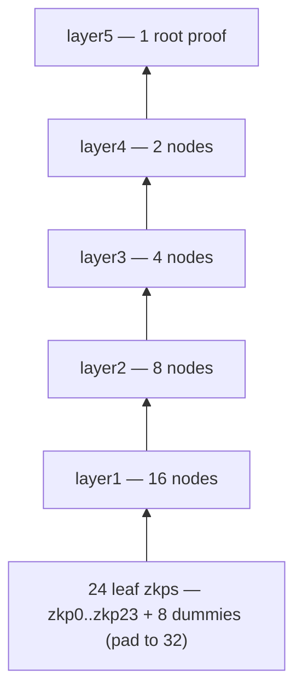

# Proof Conversion

## Role

The proof-conversion component takes PLONK and Groth16 proofs produced by
SP1, RISC Zero, or snarkjs/circom and re-verifies them inside o1js circuits.
The output is an o1js Pickles proof that Mina can verify natively. It is the
non-native proof verifier of the Ethereum→Mina ZKP bridge: bridge-head
produces an SP1 PLONK proof of Ethereum consensus, proof-conversion turns
that proof into something Mina can accept, and bridge-sdk uses it on-chain.

## Source

- Repository: <https://github.com/Nori-zk/proof-conversion>
- npm package: `@nori-zk/proof-conversion`
  (`package.json` line 2; v0.8.21)
- CLI binary: `nori-proof-converter`
  (`package.json` line 44 → `build/src/bin/cli-wrapper.js`)
- Rust crate: `proof-conversion-utils` (lib name `pairing_utils`,
  built as both `rlib` and `cdylib`; `pairing-utils/Cargo.toml` lines 2-9)
- License: Apache-2.0 OR MIT (dual; `LICENSE-APACHE`, `LICENSE-MIT`)

## Architecture

The TypeScript source under `src/` is split into pipelines and primitives:

| Path | Role |
|---|---|
| `src/plonk/` | SP1 PLONK pipeline: Miller-loop, polynomial IOP, Fiat-Shamir transcript, recursion, accumulator |
| `src/groth/` | Groth16 pipeline shared by SP1, RISC Zero, and snarkjs |
| `src/groth/risc0/` | RISC Zero-specific Groth16 hookups |
| `src/risc_zero/` | RISC Zero proof intake |
| `src/api/` | Public entry points: `ApiMethod` decorator + sp1 / risc0 / snarkjs `perform*` functions |
| `src/compute/` | `ComputationalPlanExecutor` and process pool |
| `src/compressor/` | Recursive proof compression: `layer1` and `node` ZkPrograms |
| `src/towers/`, `src/lines/`, `src/sha/`, `src/ec/`, `src/kzg/` | BN254 field tower, line evaluation, SHA helpers, EC scalar mul, KZG opening — primitives consumed by the pipelines |
| `src/pairing-utils/` | TypeScript bindings to the Rust crate |
| `src/bin/` | CLI entry points (`cli.ts`, `cli-wrapper.ts`) |

The Rust crate at `pairing-utils/` contains the performance-critical pairing
and curve work: SP1/gnark/arkworks/snarkjs byte-layout parsing, the o1js
output shape, and a `wasm-bindgen` boundary. Building it natively gives the
CLI fast pairing precompute; the WASM target lets browser callers use the
same code path through the `wasm-utils` package export.

## Public API

### `@ApiMethod` decorator (`src/api/ApiMethod.ts`)

Attaches a runtime schema and (optionally) a positional `fromArgs` helper to
each `perform*` function, so the CLI and library users get the same
validation. Two overloads: with or without args mode.

### CLI subcommands (`src/bin/cli.ts`)

```
nori-proof-converter sp1Plonk        <input.json>
nori-proof-converter sp1Groth16      <input.json>
nori-proof-converter risc0Groth16    <input.json> | <proof.json> <vk.json>
nori-proof-converter snarkjsGroth16  <input.json> | <proof.json> <vk.json> <publicInputs.json>
nori-proof-converter describe        <command>
```

Object mode takes one JSON file; args mode takes one file per top-level
schema key. Running any conversion command with no args (or `describe <cmd>`)
prints the full input schema, modes, and an example invocation.

### Output shape

Every `perform*` function returns a `ConversionOutput`
(`src/compute/types.ts`):

```ts
interface ConversionOutput {
  vkData:   { data: string; hash: string };  // VkDataOutput
  proofData: JsonProof;                       // ProofDataOutput
}
```

`vkData` is the o1js verification key for the `node` ZkProgram —
specifically, the SP1 PLONK pipeline reads it from
`<workingDir>/vks/nodeVk.json` and the root proof from
`<workingDir>/proofs/layer5/p0.json`
(`src/compute/plans/sp1/plonk.ts` lines 187-194).

The publicOutput on the root proof carries the `SubtreeCarry` struct —
three Fields `{ leftIn, rightOut, subtreeVkDigest }`
(`src/structs.ts` lines 19-23) — which o1js serializes as a length-3
string array. `proofData.publicOutput[2]` is therefore the
`subtreeVkDigest`: the Poseidon commitment to the full VK tree at the
root layer. This is the trust anchor a Mina-side verifier compares
against to confirm that the proof was produced by exactly the expected
recursion tree. See **[Trust anchors](../../architecture/trust-anchors.md)**
for how bridge-sdk pins this value.

## Build & test

From `package.json`:

```bash
npm install
npm run build                  # tsc → build/
npm run build:precompute       # one-off pairing precompute (towers + lines)
npm run test:e2e               # mm_loop, piop, e2e_playground, groth, plonk
npm run test:jest              # ESM-compatible jest (b1114 regression spec)
npm run test:validation        # schema guards (closest thing to unit tests)
```

Heap is bumped to 64 GiB (`--max-old-space-size=65536` in
`package.json` line 55). Run `npm run build:precompute` once after a fresh
build so the pairing precompute artifacts exist before any e2e job.

Rust crate (`pairing-utils/`):

```bash
cd pairing-utils
cargo build                        # rlib + cdylib
cargo build --release
cargo build --features sp1-bin     # gates the SP1-coupled binaries
./build.sh                         # wasm-pack build (wasm-bindgen + tsify)
```

### Build environment notes

- **Node ≥ 22** is required (`package.json` engines).
- **On x86**, install `numactl` and `parallel` (`apt install numactl parallel`);
  the shell helpers in `scripts/` and the executor's NUMA optimisation rely
  on them.
- The `convert_plonk.sh` helper batches SP1 PLONK conversions and expects
  the CLI to be installed globally or linked via `npm run relink`.
- The `sp1-bin` Cargo feature gates `convert_from_sp1_groth16` because
  pulling `sp1-sdk` in transitively requires `protobuf-compiler`; build
  without that feature on hosts where you only need the lighter binaries.

## The PLONK conversion path

This is the path bridge-head's SP1 PLONK proofs flow through. It is a
parallel-recursion tree: 24 leaf circuits (`zkp0..zkp23`) each verify a
chunk of the PLONK transcript work, then a 5-layer compression tree folds
them into a single o1js proof.



The 24 leaves are padded to 32 with dummy slots; the `layer1` ZkProgram is
the only layer that has to handle dummies, and it does so with explicit
identity constraints (`piLeft.publicInput.equals(piLeft.publicOutput).or(verifyLeft).assertTrue()`,
`src/compressor/layer1node.ts` lines 49-56). Higher layers use the simpler
`node` ZkProgram, which always verifies both children
(`src/compressor/compressor.ts`).

The 24-leaf split is wired in the plan, not the CLI:
`src/compute/plans/sp1/plonk.ts` line 126 spawns `range(24)` `prove_zkps`
jobs, and the loop at line 157 walks layers 1 through 5. The `appendToMakePowerOf2`
helper (`src/tree_of_vks.ts` lines 16-22) pads any non-power-of-two leaf
count to the next power of two with `NOTHING_UP_MY_SLEEVE` VK hashes.

**Parallelism (`MAX_PROCESSES`).** The CLI reads `MAX_PROCESSES` from the
environment and defaults to **1**:

```ts
// src/bin/cli.ts line 21
const MAX_PROCESSES = parseInt(process.env.MAX_PROCESSES || '1', 10);
const executor = new ComputationalPlanExecutor(MAX_PROCESSES);
```

Per the README (line 269): "Default is 1. Beyond `MAX_PROCESSES=32` no
performance gains can be expected." Setting it to 24 lets all leaf jobs
run in parallel and is roughly the sweet spot for the PLONK path, but it
takes a lot of RAM — each leaf job is spawned with `--max-old-space-size=6000`
(6 GiB heap; `src/compute/plans/sp1/plonk.ts` line 130), so 24 in flight
wants on the order of 144 GiB of headroom. Reduce based on the host. The
`numactl` package is strongly recommended on x86; without it the executor
is expected to crash on multi-socket boxes.

## The Groth16 paths

Three Groth16 entry points share `src/groth/` and differ in intake:

- **SP1 Groth16** (`src/api/sp1/groth16.ts`) — input is the SP1 proof
  object; the Rust binary `convert_from_sp1_groth16` strips the v6 96-byte
  gnark calldata prefix and emits o1js-shaped output. Object mode only.
- **RISC Zero Groth16** (`src/api/risc0/groth16.ts`) — `Risc0Groth16ComputationalPlan`
  handles the RISC Zero-specific VK pairing precompute. Object and args modes.
- **snarkjs Groth16** (`src/api/snarkjs/groth16.ts`) — `SnarkjsGroth16ComputationalPlan`
  drives `convert_from_snarkjs`. Object and args modes (proof, vk, publicInputs).

All three target o1js and share the underlying tower / line / EC / KZG
primitives.

## See also

- [Architecture](../../architecture/index.md) — where proof-conversion sits in the bridge.
- [Trust anchors](../../architecture/trust-anchors.md) — how `subtreeVkDigest` is pinned on Mina.
- [Bridge Head](../bridge-head/index.md) — the producer of SP1 PLONK proofs that feed the PLONK path.
- [Bridge SDK](../bridge-sdk/index.md) — the Mina-side consumer that anchors `vkData.hash` and `subtreeVkDigest` in its integrity layer.
